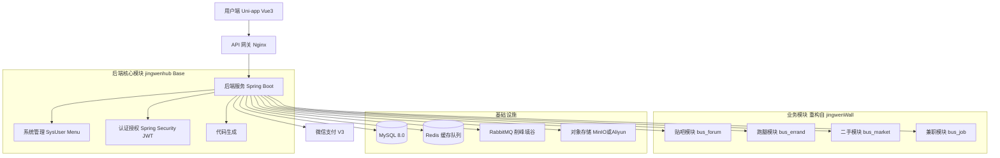

# 荆文校园综合服务平台 - 详细重构实施指南

> **版本**: v1.0  
> **更新日期**: 2026-01-09  
> **适用范围**: 本文档详细描述了将 `jingwenWall` 项目业务逻辑迁移至 `jingwenhub` 基座的完整重构流程

---

## 目录

1. [项目现状分析](#1-项目现状分析)
2. [重构目标与技术栈](#2-重构目标与技术栈)
3. [阶段一：基础环境整合](#3-阶段一基础环境整合-weeks-1-3)
4. [阶段二：核心业务开发](#4-阶段二核心业务开发-weeks-4-6)
5. [阶段三：前端重构](#5-阶段三前端重构-weeks-7-10)
6. [阶段四：支付与联调](#6-阶段四支付与联调-weeks-11-12)
7. [阶段五：部署与运维](#7-阶段五部署与运维)
8. [附录：代码模板与参考](#8-附录代码模板与参考)

---

## 1. 项目现状分析

### 1.1 jingwenhub (基座项目) 结构分析

```
jingwenhub/
├── campus-admin/          # 后台管理 Controller 层
│   └── controller/
│       ├── monitor/       # 系统监控 (登录日志、操作日志)
│       └── system/        # 系统管理 (用户、角色、菜单、字典等)
├── campus-common/         # 通用工具类
│   ├── annotation/        # 自定义注解 (@Anonymous, @Log, @RepeatSubmit)
│   ├── constant/          # 常量定义 (CacheConstants, HttpStatus)
│   ├── domain/            # 通用域对象
│   │   ├── entity/        # 系统实体 (SysUser, SysRole, SysMenu等)
│   │   ├── model/         # 数据模型 (LoginBody, LoginUser)
│   │   └── R.java         # 统一响应封装类
│   ├── exception/         # 异常定义
│   └── utils/             # 工具类 (SecurityUtils, StringUtils等)
├── campus-framework/      # 核心框架配置
│   ├── security/          # Spring Security 配置
│   │   ├── filter/        # JWT 过滤器
│   │   └── handle/        # 认证成功/失败处理器
│   ├── service/           # 框架级服务 (SysUserService, TokenService)
│   └── mapper/            # 系统级 Mapper
├── campus-modular/        # 业务模块
│   ├── business/
│   │   ├── controller/
│   │   │   ├── admin/     # 后台管理接口 (审核、数据管理)
│   │   │   └── web/       # 前端用户接口 (内容、评论、用户)
│   │   ├── domain/
│   │   │   └── entity/    # 业务实体 (ContentEntity, CategoryEntity等)
│   │   ├── mapper/        # 业务 Mapper
│   │   └── service/       # 业务服务 (ContentService, CommentService等)
│   └── resources/
│       ├── mapper/        # MyBatis XML 映射文件
│       └── application.yml
└── vue_campus_admin/      # PC 管理端前端 (Vue 2 + Element UI)
```

**核心技术栈**:
| 组件 | 版本 |
|------|------|
| Spring Boot | 2.5.14 |
| MyBatis-Plus | 3.5.2 |
| Spring Security | 5.x (含JWT) |
| MySQL | 8.0+ |
| Redis | 6.0+ |
| Fastjson2 | 2.0.14 |
| Hutool | 5.8.8 |

**现有数据库表**:
- `sys_user` - 系统用户表
- `sys_role` / `sys_menu` - RBAC 权限表
- `campus_content` - 内容/帖子表
- `campus_category` - 分类表
- `campus_comment` - 评论表
- `campus_content_love` - 点赞关联表
- `campus_tag` / `campus_content_tag` - 标签表

---

### 1.2 jingwenWall (待迁移项目) 结构分析

```
backend/
├── wall-common/           # 通用模块
│   ├── constant/          # 常量 (MessageConstant)
│   ├── properties/        # 配置属性 (AliOssProperties, WeChatProperties)
│   ├── result/            # 响应封装 (Result, PageResult)
│   └── utils/             # 工具类 (AliOssUtil, ContentCheckUtil, ImageCheckUtil)
├── wall-pojo/             # 实体对象
│   ├── dto/               # 数据传输对象 (TopicDTO, StudentDTO, PageQueryDTO)
│   ├── entity/            # 实体类
│   │   ├── Topic.java     # 话题实体
│   │   ├── Student.java   # 学生实体 (含openid微信登录)
│   │   ├── Comment.java   # 评论实体
│   │   ├── Admin.java     # 管理员实体
│   │   └── Report.java    # 举报实体
│   └── vo/                # 视图对象
└── wall-server/           # 服务端
    ├── controller/
    │   ├── admin/         # 管理端接口
    │   └── student/       # 学生端接口
    ├── service/
    │   └── impl/          # 服务实现 (TopicServiceImpl, StudentServiceImpl)
    └── mapper/            # Mapper 接口
```

**现有数据库表** (nottinghamwall.sql):
- `student` - 学生用户表 (含 openid 微信登录)
- `topic` - 话题/帖子表
- `comment` - 评论表
- `like` - 点赞表
- `collection` - 收藏表
- `comment_like` - 评论点赞表
- `report` - 举报表
- `admin` - 管理员表

**核心业务功能**:
- 微信小程序登录 (通过 openid)
- 话题发布/编辑/删除 (含草稿功能)
- 评论系统 (支持二级评论)
- 点赞/收藏功能
- 阿里云 OSS 图片上传
- 内容安全审核 (阿里云绿网 + 微信内容安全)

---

### 1.3 uniapp 前端结构分析

```
uniapp/
├── src/
│   ├── api/               # API 接口封装
│   │   ├── topic.js       # 话题相关接口
│   │   ├── comment.js     # 评论接口
│   │   ├── like.js        # 点赞接口
│   │   ├── collect.js     # 收藏接口
│   │   ├── login.js       # 登录接口
│   │   └── user.js        # 用户接口
│   ├── pages/             # 页面
│   │   ├── index/         # 首页
│   │   ├── topic/         # 话题详情/发布
│   │   ├── person/        # 个人中心
│   │   ├── favorites/     # 收藏页
│   │   ├── message/       # 消息页
│   │   └── order/         # 订单页 (预留)
│   └── utils/             # 工具类
├── package.json           # 依赖配置 (Vue 3.4 + Pinia + uni-app)
```

**技术栈**:
- Vue 3.4 + Composition API
- Pinia 状态管理
- uni-app 3.x (Vite 版)
- 微信小程序为主要目标平台

---

## 2. 重构目标与技术栈

### 2.1 最终架构愿景



### 2.2 技术选型确认

| 层级 | 当前 | 目标 | 说明 |
|------|------|------|------|
| **后端框架** | Spring Boot 2.5.14 | Spring Boot 2.5.14 | 保持稳定 |
| **ORM** | MyBatis-Plus 3.5.2 | MyBatis-Plus 3.5.2 | 无需变更 |
| **认证** | Spring Security + JWT | Spring Security + JWT + 微信登录 | 扩展微信登录 |
| **缓存** | Redis | Redis | 增加分布式锁 |
| **消息队列** | 无 | RabbitMQ | 新增订单处理 |
| **存储** | 本地/阿里云 OSS | 阿里云 OSS / MinIO | 统一使用 |
| **支付** | 无 | 微信支付 V3 | 新增 |
| **前端** | Vue 2 (管理端) + uni-app | Vue 3 (管理端) + uni-app (Vue3) | 升级管理端 |

### 2.3 模块划分规划

重构后的 `campus-modular` 模块结构:

```
campus-modular/src/main/java/com/oddfar/campus/
├── business/
│   ├── forum/           # 贴吧模块 (迁移自 jingwenWall Topic)
│   │   ├── controller/
│   │   ├── domain/
│   │   │   ├── entity/  # BusForumPost, BusForumCategory
│   │   │   ├── dto/
│   │   │   └── vo/
│   │   ├── mapper/
│   │   └── service/
│   ├── errand/          # 跑腿模块 (新开发)
│   │   ├── controller/
│   │   ├── domain/
│   │   │   └── entity/  # BusErrandOrder, BusErrandRunner
│   │   ├── mapper/
│   │   └── service/
│   ├── market/          # 二手交易模块 (新开发)
│   │   ├── controller/
│   │   ├── domain/
│   │   │   └── entity/  # BusMarketItem, BusMarketOrder
│   │   ├── mapper/
│   │   └── service/
│   ├── job/             # 兼职模块 (新开发)
│   │   ├── controller/
│   │   ├── domain/
│   │   │   └── entity/  # BusJobPost, BusJobApplication
│   │   ├── mapper/
│   │   └── service/
│   ├── student/         # 学生扩展模块 (核心用户扩展)
│   │   ├── controller/
│   │   ├── domain/
│   │   │   └── entity/  # BusStudent (扩展 sys_user)
│   │   ├── mapper/
│   │   └── service/
│   └── common/          # 通用业务组件
│       ├── oss/         # 对象存储服务
│       ├── pay/         # 支付服务
│       └── content/     # 内容审核服务
```

---

## 3. 阶段一：基础环境整合 (Weeks 1-3)

### 3.1 Week 1: 环境准备与数据库设计

#### 3.1.1 任务清单

- [ ] **T1.1** 克隆并搭建 jingwenhub 开发环境
- [ ] **T1.2** 设计并创建扩展数据库表
- [ ] **T1.3** 配置开发环境 (MySQL, Redis, IDE)
- [ ] **T1.4** 清理 jingwenhub 中不需要的示例代码

#### 3.1.2 数据库表设计 (SQL)

创建文件: `jingwenhub/sql/bus_tables_v1.0.sql`

```sql
-- ============================================
-- 荆文校园综合服务平台 - 业务表设计 v1.0
-- ============================================

SET NAMES utf8mb4;
SET FOREIGN_KEY_CHECKS = 0;

-- -------------------------------------------
-- 1. 学生信息扩展表 (与 sys_user 1:1 关联)
-- -------------------------------------------
DROP TABLE IF EXISTS `bus_student`;
CREATE TABLE `bus_student` (
  `student_id` bigint(20) NOT NULL AUTO_INCREMENT COMMENT '主键',
  `user_id` bigint(20) NOT NULL COMMENT '关联sys_user的user_id',
  `openid` varchar(64) DEFAULT NULL COMMENT '微信OpenID',
  `unionid` varchar(64) DEFAULT NULL COMMENT '微信UnionID',
  `student_no` varchar(32) DEFAULT NULL COMMENT '学号',
  `real_name` varchar(32) DEFAULT NULL COMMENT '真实姓名',
  `college` varchar(64) DEFAULT NULL COMMENT '学院',
  `major` varchar(64) DEFAULT NULL COMMENT '专业',
  `grade` varchar(10) DEFAULT NULL COMMENT '年级',
  `credit_score` int(11) DEFAULT 100 COMMENT '信用分 (初始100)',
  `balance` decimal(10,2) DEFAULT 0.00 COMMENT '钱包余额',
  `is_verified` tinyint(1) DEFAULT 0 COMMENT '是否实名认证 (0否 1是)',
  `is_runner` tinyint(1) DEFAULT 0 COMMENT '是否认证骑手 (0否 1是)',
  `del_flag` bit(1) DEFAULT b'0' COMMENT '逻辑删除',
  `create_time` datetime DEFAULT CURRENT_TIMESTAMP COMMENT '创建时间',
  `update_time` datetime DEFAULT CURRENT_TIMESTAMP ON UPDATE CURRENT_TIMESTAMP COMMENT '更新时间',
  PRIMARY KEY (`student_id`),
  UNIQUE KEY `uk_user_id` (`user_id`),
  UNIQUE KEY `uk_openid` (`openid`),
  KEY `idx_student_no` (`student_no`)
) ENGINE=InnoDB DEFAULT CHARSET=utf8mb4 COMMENT='学生信息扩展表';

-- -------------------------------------------
-- 2. 贴吧帖子表 (迁移并优化自 jingwenWall topic)
-- -------------------------------------------
DROP TABLE IF EXISTS `bus_forum_post`;
CREATE TABLE `bus_forum_post` (
  `post_id` bigint(20) NOT NULL COMMENT '帖子ID (雪花算法)',
  `user_id` bigint(20) NOT NULL COMMENT '发布者user_id',
  `category_id` bigint(20) NOT NULL COMMENT '板块ID (关联campus_category)',
  `title` varchar(100) DEFAULT NULL COMMENT '标题 (可选)',
  `content` text COMMENT '文本内容',
  `images` json DEFAULT NULL COMMENT '图片列表(JSON数组)',
  `is_anonymous` tinyint(1) DEFAULT 0 COMMENT '是否匿名 (0否 1是)',
  `is_draft` tinyint(1) DEFAULT 0 COMMENT '是否草稿 (0否 1是)',
  `view_count` int(11) DEFAULT 0 COMMENT '浏览量',
  `like_count` int(11) DEFAULT 0 COMMENT '点赞数',
  `comment_count` int(11) DEFAULT 0 COMMENT '评论数',
  `collect_count` int(11) DEFAULT 0 COMMENT '收藏数',
  `status` tinyint(4) DEFAULT 0 COMMENT '状态: 0审核中 1正常 2下架 3拒绝',
  `ip` varchar(64) DEFAULT NULL COMMENT '发布IP',
  `address` varchar(100) DEFAULT NULL COMMENT '发布地址',
  `del_flag` bit(1) DEFAULT b'0' COMMENT '逻辑删除',
  `create_time` datetime DEFAULT CURRENT_TIMESTAMP COMMENT '创建时间',
  `create_user` bigint(20) DEFAULT NULL COMMENT '创建人',
  `update_time` datetime DEFAULT CURRENT_TIMESTAMP ON UPDATE CURRENT_TIMESTAMP COMMENT '更新时间',
  `update_user` bigint(20) DEFAULT NULL COMMENT '更新人',
  PRIMARY KEY (`post_id`),
  KEY `idx_user_id` (`user_id`),
  KEY `idx_category_id` (`category_id`),
  KEY `idx_status` (`status`),
  KEY `idx_create_time` (`create_time`)
) ENGINE=InnoDB DEFAULT CHARSET=utf8mb4 COMMENT='贴吧帖子表';

-- -------------------------------------------
-- 3. 帖子点赞表
-- -------------------------------------------
DROP TABLE IF EXISTS `bus_forum_like`;
CREATE TABLE `bus_forum_like` (
  `user_id` bigint(20) NOT NULL COMMENT '用户ID',
  `post_id` bigint(20) NOT NULL COMMENT '帖子ID',
  `create_time` datetime DEFAULT CURRENT_TIMESTAMP COMMENT '点赞时间',
  PRIMARY KEY (`user_id`, `post_id`),
  KEY `idx_post_id` (`post_id`)
) ENGINE=InnoDB DEFAULT CHARSET=utf8mb4 COMMENT='帖子点赞表';

-- -------------------------------------------
-- 4. 帖子收藏表
-- -------------------------------------------
DROP TABLE IF EXISTS `bus_forum_collect`;
CREATE TABLE `bus_forum_collect` (
  `user_id` bigint(20) NOT NULL COMMENT '用户ID',
  `post_id` bigint(20) NOT NULL COMMENT '帖子ID',
  `create_time` datetime DEFAULT CURRENT_TIMESTAMP COMMENT '收藏时间',
  PRIMARY KEY (`user_id`, `post_id`),
  KEY `idx_post_id` (`post_id`)
) ENGINE=InnoDB DEFAULT CHARSET=utf8mb4 COMMENT='帖子收藏表';

-- -------------------------------------------
-- 5. 帖子评论表 (优化自 campus_comment)
-- -------------------------------------------
DROP TABLE IF EXISTS `bus_forum_comment`;
CREATE TABLE `bus_forum_comment` (
  `comment_id` bigint(20) NOT NULL COMMENT '评论ID',
  `post_id` bigint(20) NOT NULL COMMENT '帖子ID',
  `user_id` bigint(20) NOT NULL COMMENT '评论者ID',
  `parent_id` bigint(20) DEFAULT 0 COMMENT '父评论ID (0为一级评论)',
  `root_id` bigint(20) DEFAULT NULL COMMENT '根评论ID (方便查询整个评论树)',
  `to_user_id` bigint(20) DEFAULT NULL COMMENT '回复目标用户ID',
  `content` varchar(500) NOT NULL COMMENT '评论内容',
  `like_count` int(11) DEFAULT 0 COMMENT '点赞数',
  `ip` varchar(64) DEFAULT NULL COMMENT '评论IP',
  `address` varchar(100) DEFAULT NULL COMMENT '评论地址',
  `status` tinyint(4) DEFAULT 1 COMMENT '状态: 0审核中 1正常 2删除',
  `del_flag` bit(1) DEFAULT b'0' COMMENT '逻辑删除',
  `create_time` datetime DEFAULT CURRENT_TIMESTAMP COMMENT '创建时间',
  `update_time` datetime DEFAULT CURRENT_TIMESTAMP ON UPDATE CURRENT_TIMESTAMP COMMENT '更新时间',
  PRIMARY KEY (`comment_id`),
  KEY `idx_post_id` (`post_id`),
  KEY `idx_user_id` (`user_id`),
  KEY `idx_parent_id` (`parent_id`)
) ENGINE=InnoDB DEFAULT CHARSET=utf8mb4 COMMENT='帖子评论表';

-- -------------------------------------------
-- 6. 评论点赞表
-- -------------------------------------------
DROP TABLE IF EXISTS `bus_forum_comment_like`;
CREATE TABLE `bus_forum_comment_like` (
  `user_id` bigint(20) NOT NULL COMMENT '用户ID',
  `comment_id` bigint(20) NOT NULL COMMENT '评论ID',
  `create_time` datetime DEFAULT CURRENT_TIMESTAMP COMMENT '点赞时间',
  PRIMARY KEY (`user_id`, `comment_id`)
) ENGINE=InnoDB DEFAULT CHARSET=utf8mb4 COMMENT='评论点赞表';

-- -------------------------------------------
-- 7. 跑腿订单表 (核心盈利模块)
-- -------------------------------------------
DROP TABLE IF EXISTS `bus_errand_order`;
CREATE TABLE `bus_errand_order` (
  `order_id` bigint(20) NOT NULL COMMENT '订单ID (雪花算法)',
  `order_no` varchar(64) NOT NULL COMMENT '订单号 (业务号)',
  `publisher_id` bigint(20) NOT NULL COMMENT '发布者ID',
  `runner_id` bigint(20) DEFAULT NULL COMMENT '接单骑手ID',
  `type` tinyint(4) NOT NULL COMMENT '类型: 0取快递 1代买餐 2寄快递 3排队 4其他',
  `pickup_addr` varchar(255) DEFAULT NULL COMMENT '取件地址',
  `pickup_lat` decimal(10,6) DEFAULT NULL COMMENT '取件纬度',
  `pickup_lng` decimal(10,6) DEFAULT NULL COMMENT '取件经度',
  `delivery_addr` varchar(255) NOT NULL COMMENT '送达地址',
  `delivery_lat` decimal(10,6) DEFAULT NULL COMMENT '送达纬度',
  `delivery_lng` decimal(10,6) DEFAULT NULL COMMENT '送达经度',
  `goods_desc` varchar(255) DEFAULT NULL COMMENT '物品描述',
  `goods_weight` varchar(50) DEFAULT NULL COMMENT '物品重量',
  `expect_time` datetime DEFAULT NULL COMMENT '期望送达时间',
  `tip` decimal(10,2) DEFAULT 0.00 COMMENT '小费',
  `base_fee` decimal(10,2) NOT NULL COMMENT '基础配送费',
  `total_fee` decimal(10,2) NOT NULL COMMENT '总费用',
  `runner_fee` decimal(10,2) DEFAULT NULL COMMENT '骑手佣金',
  `platform_fee` decimal(10,2) DEFAULT NULL COMMENT '平台抽成',
  `pay_status` tinyint(4) DEFAULT 0 COMMENT '支付状态: 0未支付 1已支付 2已退款',
  `pay_time` datetime DEFAULT NULL COMMENT '支付时间',
  `pay_order_no` varchar(64) DEFAULT NULL COMMENT '支付订单号',
  `status` tinyint(4) DEFAULT 0 COMMENT '订单状态: 0待接单 1已接单 2取件中 3配送中 4待确认 5已完成 6已取消',
  `cancel_reason` varchar(255) DEFAULT NULL COMMENT '取消原因',
  `remark` varchar(500) DEFAULT NULL COMMENT '备注',
  `version` int(11) DEFAULT 0 COMMENT '乐观锁版本号',
  `del_flag` bit(1) DEFAULT b'0' COMMENT '逻辑删除',
  `create_time` datetime DEFAULT CURRENT_TIMESTAMP COMMENT '创建时间',
  `update_time` datetime DEFAULT CURRENT_TIMESTAMP ON UPDATE CURRENT_TIMESTAMP COMMENT '更新时间',
  PRIMARY KEY (`order_id`),
  UNIQUE KEY `uk_order_no` (`order_no`),
  KEY `idx_publisher_id` (`publisher_id`),
  KEY `idx_runner_id` (`runner_id`),
  KEY `idx_status` (`status`),
  KEY `idx_create_time` (`create_time`)
) ENGINE=InnoDB DEFAULT CHARSET=utf8mb4 COMMENT='跑腿订单表';

-- -------------------------------------------
-- 8. 骑手认证表
-- -------------------------------------------
DROP TABLE IF EXISTS `bus_errand_runner`;
CREATE TABLE `bus_errand_runner` (
  `runner_id` bigint(20) NOT NULL AUTO_INCREMENT COMMENT '骑手ID',
  `user_id` bigint(20) NOT NULL COMMENT '用户ID',
  `real_name` varchar(32) NOT NULL COMMENT '真实姓名',
  `id_card` varchar(18) NOT NULL COMMENT '身份证号',
  `id_card_front` varchar(255) DEFAULT NULL COMMENT '身份证正面照',
  `id_card_back` varchar(255) DEFAULT NULL COMMENT '身份证背面照',
  `student_card` varchar(255) DEFAULT NULL COMMENT '学生证照片',
  `total_orders` int(11) DEFAULT 0 COMMENT '完成订单数',
  `total_income` decimal(10,2) DEFAULT 0.00 COMMENT '累计收入',
  `rating` decimal(3,2) DEFAULT 5.00 COMMENT '评分',
  `status` tinyint(4) DEFAULT 0 COMMENT '状态: 0待审核 1通过 2拒绝 3禁用',
  `audit_remark` varchar(255) DEFAULT NULL COMMENT '审核备注',
  `del_flag` bit(1) DEFAULT b'0' COMMENT '逻辑删除',
  `create_time` datetime DEFAULT CURRENT_TIMESTAMP COMMENT '创建时间',
  `update_time` datetime DEFAULT CURRENT_TIMESTAMP ON UPDATE CURRENT_TIMESTAMP COMMENT '更新时间',
  PRIMARY KEY (`runner_id`),
  UNIQUE KEY `uk_user_id` (`user_id`),
  KEY `idx_status` (`status`)
) ENGINE=InnoDB DEFAULT CHARSET=utf8mb4 COMMENT='骑手认证表';

-- -------------------------------------------
-- 9. 二手商品表
-- -------------------------------------------
DROP TABLE IF EXISTS `bus_market_item`;
CREATE TABLE `bus_market_item` (
  `item_id` bigint(20) NOT NULL COMMENT '商品ID',
  `user_id` bigint(20) NOT NULL COMMENT '发布者ID',
  `category_id` bigint(20) DEFAULT NULL COMMENT '商品分类ID',
  `title` varchar(100) NOT NULL COMMENT '商品标题',
  `description` text COMMENT '商品描述',
  `images` json DEFAULT NULL COMMENT '图片列表(JSON)',
  `price` decimal(10,2) NOT NULL COMMENT '售价',
  `original_price` decimal(10,2) DEFAULT NULL COMMENT '原价',
  `condition_level` tinyint(4) DEFAULT 9 COMMENT '成色: 1-10',
  `trade_method` tinyint(4) DEFAULT 0 COMMENT '交易方式: 0自提 1邮寄 2都可',
  `trade_location` varchar(255) DEFAULT NULL COMMENT '交易地点',
  `view_count` int(11) DEFAULT 0 COMMENT '浏览量',
  `collect_count` int(11) DEFAULT 0 COMMENT '收藏数',
  `status` tinyint(4) DEFAULT 0 COMMENT '状态: 0待审核 1在售 2已售 3下架',
  `del_flag` bit(1) DEFAULT b'0' COMMENT '逻辑删除',
  `create_time` datetime DEFAULT CURRENT_TIMESTAMP COMMENT '创建时间',
  `update_time` datetime DEFAULT CURRENT_TIMESTAMP ON UPDATE CURRENT_TIMESTAMP COMMENT '更新时间',
  PRIMARY KEY (`item_id`),
  KEY `idx_user_id` (`user_id`),
  KEY `idx_category_id` (`category_id`),
  KEY `idx_status` (`status`)
) ENGINE=InnoDB DEFAULT CHARSET=utf8mb4 COMMENT='二手商品表';

-- -------------------------------------------
-- 10. 兼职信息表
-- -------------------------------------------
DROP TABLE IF EXISTS `bus_job_post`;
CREATE TABLE `bus_job_post` (
  `job_id` bigint(20) NOT NULL COMMENT '兼职ID',
  `publisher_id` bigint(20) NOT NULL COMMENT '发布者ID (商家或管理员)',
  `title` varchar(100) NOT NULL COMMENT '职位标题',
  `company_name` varchar(100) DEFAULT NULL COMMENT '公司/店铺名称',
  `description` text COMMENT '职位描述',
  `requirements` text COMMENT '任职要求',
  `salary_type` tinyint(4) DEFAULT 0 COMMENT '薪资类型: 0日结 1周结 2月结',
  `salary_min` decimal(10,2) DEFAULT NULL COMMENT '薪资下限',
  `salary_max` decimal(10,2) DEFAULT NULL COMMENT '薪资上限',
  `salary_unit` varchar(20) DEFAULT '元/小时' COMMENT '薪资单位',
  `work_time` varchar(255) DEFAULT NULL COMMENT '工作时间',
  `work_location` varchar(255) DEFAULT NULL COMMENT '工作地点',
  `contact_name` varchar(32) DEFAULT NULL COMMENT '联系人',
  `contact_phone` varchar(20) DEFAULT NULL COMMENT '联系电话',
  `contact_wechat` varchar(50) DEFAULT NULL COMMENT '联系微信',
  `headcount` int(11) DEFAULT 1 COMMENT '招聘人数',
  `applied_count` int(11) DEFAULT 0 COMMENT '已申请人数',
  `view_count` int(11) DEFAULT 0 COMMENT '浏览量',
  `is_top` tinyint(1) DEFAULT 0 COMMENT '是否置顶',
  `top_expire_time` datetime DEFAULT NULL COMMENT '置顶过期时间',
  `status` tinyint(4) DEFAULT 0 COMMENT '状态: 0待审核 1招聘中 2已结束 3下架',
  `del_flag` bit(1) DEFAULT b'0' COMMENT '逻辑删除',
  `create_time` datetime DEFAULT CURRENT_TIMESTAMP COMMENT '创建时间',
  `update_time` datetime DEFAULT CURRENT_TIMESTAMP ON UPDATE CURRENT_TIMESTAMP COMMENT '更新时间',
  PRIMARY KEY (`job_id`),
  KEY `idx_publisher_id` (`publisher_id`),
  KEY `idx_status` (`status`),
  KEY `idx_is_top` (`is_top`)
) ENGINE=InnoDB DEFAULT CHARSET=utf8mb4 COMMENT='兼职信息表';

-- -------------------------------------------
-- 11. 兼职申请表
-- -------------------------------------------
DROP TABLE IF EXISTS `bus_job_application`;
CREATE TABLE `bus_job_application` (
  `application_id` bigint(20) NOT NULL COMMENT '申请ID',
  `job_id` bigint(20) NOT NULL COMMENT '兼职ID',
  `user_id` bigint(20) NOT NULL COMMENT '申请者ID',
  `resume` text COMMENT '简历/自我介绍',
  `contact_phone` varchar(20) DEFAULT NULL COMMENT '联系电话',
  `status` tinyint(4) DEFAULT 0 COMMENT '状态: 0待处理 1通过 2拒绝',
  `remark` varchar(255) DEFAULT NULL COMMENT '备注',
  `del_flag` bit(1) DEFAULT b'0' COMMENT '逻辑删除',
  `create_time` datetime DEFAULT CURRENT_TIMESTAMP COMMENT '申请时间',
  `update_time` datetime DEFAULT CURRENT_TIMESTAMP ON UPDATE CURRENT_TIMESTAMP COMMENT '更新时间',
  PRIMARY KEY (`application_id`),
  KEY `idx_job_id` (`job_id`),
  KEY `idx_user_id` (`user_id`)
) ENGINE=InnoDB DEFAULT CHARSET=utf8mb4 COMMENT='兼职申请表';

-- -------------------------------------------
-- 12. 举报表 (通用)
-- -------------------------------------------
DROP TABLE IF EXISTS `bus_report`;
CREATE TABLE `bus_report` (
  `report_id` bigint(20) NOT NULL COMMENT '举报ID',
  `reporter_id` bigint(20) NOT NULL COMMENT '举报人ID',
  `target_type` tinyint(4) NOT NULL COMMENT '举报目标类型: 0帖子 1评论 2用户 3商品 4兼职',
  `target_id` bigint(20) NOT NULL COMMENT '举报目标ID',
  `reason_type` varchar(50) DEFAULT NULL COMMENT '举报原因类型',
  `reason_detail` text COMMENT '详细描述',
  `images` json DEFAULT NULL COMMENT '举报截图',
  `status` tinyint(4) DEFAULT 0 COMMENT '状态: 0待处理 1已处理 2已忽略',
  `handle_remark` varchar(255) DEFAULT NULL COMMENT '处理备注',
  `handle_user_id` bigint(20) DEFAULT NULL COMMENT '处理人ID',
  `handle_time` datetime DEFAULT NULL COMMENT '处理时间',
  `del_flag` bit(1) DEFAULT b'0' COMMENT '逻辑删除',
  `create_time` datetime DEFAULT CURRENT_TIMESTAMP COMMENT '举报时间',
  PRIMARY KEY (`report_id`),
  KEY `idx_target` (`target_type`, `target_id`),
  KEY `idx_status` (`status`)
) ENGINE=InnoDB DEFAULT CHARSET=utf8mb4 COMMENT='举报表';

-- -------------------------------------------
-- 13. 钱包流水表
-- -------------------------------------------
DROP TABLE IF EXISTS `bus_wallet_record`;
CREATE TABLE `bus_wallet_record` (
  `record_id` bigint(20) NOT NULL COMMENT '记录ID',
  `user_id` bigint(20) NOT NULL COMMENT '用户ID',
  `type` tinyint(4) NOT NULL COMMENT '类型: 0充值 1提现 2收入 3支出 4退款',
  `amount` decimal(10,2) NOT NULL COMMENT '金额',
  `balance_before` decimal(10,2) DEFAULT NULL COMMENT '变动前余额',
  `balance_after` decimal(10,2) DEFAULT NULL COMMENT '变动后余额',
  `related_order_no` varchar(64) DEFAULT NULL COMMENT '关联订单号',
  `remark` varchar(255) DEFAULT NULL COMMENT '备注',
  `create_time` datetime DEFAULT CURRENT_TIMESTAMP COMMENT '创建时间',
  PRIMARY KEY (`record_id`),
  KEY `idx_user_id` (`user_id`),
  KEY `idx_create_time` (`create_time`)
) ENGINE=InnoDB DEFAULT CHARSET=utf8mb4 COMMENT='钱包流水表';

SET FOREIGN_KEY_CHECKS = 1;
```

#### 3.1.3 配置文件修改

修改 `jingwenhub/campus-modular/src/main/resources/application.yml`:

```yaml
# 新增配置项
campus:
  name: jingwen-campus
  version: 2.0.0

# 微信小程序配置
wechat:
  mini:
    appid: ${WECHAT_APPID:your_appid}
    secret: ${WECHAT_SECRET:your_secret}

# 阿里云 OSS 配置
aliyun:
  oss:
    endpoint: ${OSS_ENDPOINT:oss-cn-beijing.aliyuncs.com}
    access-key-id: ${OSS_ACCESS_KEY_ID:your_key}
    access-key-secret: ${OSS_ACCESS_KEY_SECRET:your_secret}
    bucket-name: ${OSS_BUCKET:your_bucket}

# 内容安全审核
content-check:
  enabled: true
  provider: aliyun  # aliyun / wechat

# 跑腿订单配置
errand:
  platform-rate: 0.15  # 平台抽成比例 15%
  base-fee: 3.00       # 基础配送费
  distance-fee: 1.00   # 每公里加价
```

---

### 3.2 Week 2: 用户体系整合与微信登录

#### 3.2.1 任务清单

- [ ] **T2.1** 创建 BusStudent 实体和 Mapper
- [ ] **T2.2** 实现微信小程序登录接口
- [ ] **T2.3** 整合 JWT Token 与微信用户绑定
- [ ] **T2.4** 用户注册/登录单元测试

#### 3.2.2 BusStudent 实体类

文件: `campus-modular/src/main/java/com/oddfar/campus/business/student/domain/entity/BusStudentEntity.java`

```java
package com.oddfar.campus.business.student.domain.entity;

import com.baomidou.mybatisplus.annotation.*;
import com.oddfar.campus.common.domain.BaseEntity;
import lombok.Data;
import lombok.EqualsAndHashCode;

import java.math.BigDecimal;

/**
 * 学生信息扩展表
 */
@Data
@TableName("bus_student")
@EqualsAndHashCode(callSuper = true)
public class BusStudentEntity extends BaseEntity {
    
    @TableId(value = "student_id", type = IdType.AUTO)
    private Long studentId;
    
    /** 关联 sys_user 的 user_id */
    private Long userId;
    
    /** 微信 OpenID */
    private String openid;
    
    /** 微信 UnionID */
    private String unionid;
    
    /** 学号 */
    private String studentNo;
    
    /** 真实姓名 */
    private String realName;
    
    /** 学院 */
    private String college;
    
    /** 专业 */
    private String major;
    
    /** 年级 */
    private String grade;
    
    /** 信用分 */
    private Integer creditScore;
    
    /** 钱包余额 */
    private BigDecimal balance;
    
    /** 是否实名认证 */
    private Integer isVerified;
    
    /** 是否认证骑手 */
    private Integer isRunner;
    
    /** 头像 (冗余字段，便于查询) */
    @TableField(exist = false)
    private String avatar;
    
    /** 昵称 (冗余字段) */
    @TableField(exist = false)
    private String nickName;
}
```

#### 3.2.3 微信登录 DTO

文件: `campus-modular/src/main/java/com/oddfar/campus/business/student/domain/dto/WxLoginDTO.java`

```java
package com.oddfar.campus.business.student.domain.dto;

import lombok.Data;
import javax.validation.constraints.NotBlank;

/**
 * 微信小程序登录请求
 */
@Data
public class WxLoginDTO {
    
    /** 微信临时登录凭证 code */
    @NotBlank(message = "code不能为空")
    private String code;
    
    /** 加密数据 (获取手机号时需要) */
    private String encryptedData;
    
    /** 加密算法初始向量 */
    private String iv;
    
    /** 用户信息原始数据 */
    private String rawData;
    
    /** 签名 */
    private String signature;
    
    /** 用户昵称 */
    private String nickName;
    
    /** 用户头像 */
    private String avatarUrl;
}
```

#### 3.2.4 微信登录服务接口

文件: `campus-modular/src/main/java/com/oddfar/campus/business/student/service/WxAuthService.java`

```java
package com.oddfar.campus.business.student.service;

import com.oddfar.campus.business.student.domain.dto.WxLoginDTO;
import com.oddfar.campus.business.student.domain.vo.WxLoginVO;

/**
 * 微信认证服务
 */
public interface WxAuthService {
    
    /**
     * 微信小程序登录
     * @param wxLoginDTO 登录请求
     * @return 登录结果 (含 token)
     */
    WxLoginVO wxLogin(WxLoginDTO wxLoginDTO);
    
    /**
     * 获取微信 AccessToken
     * @return accessToken
     */
    String getAccessToken();
    
    /**
     * 绑定手机号
     * @param userId 用户ID
     * @param phoneCode 手机号获取凭证
     * @return 是否成功
     */
    boolean bindPhone(Long userId, String phoneCode);
}
```

#### 3.2.5 微信登录控制器

文件: `campus-modular/src/main/java/com/oddfar/campus/business/student/controller/WxAuthController.java`

```java
package com.oddfar.campus.business.student.controller;

import com.oddfar.campus.business.student.domain.dto.WxLoginDTO;
import com.oddfar.campus.business.student.domain.vo.WxLoginVO;
import com.oddfar.campus.business.student.service.WxAuthService;
import com.oddfar.campus.common.annotation.Anonymous;
import com.oddfar.campus.common.domain.R;
import io.swagger.annotations.Api;
import io.swagger.annotations.ApiOperation;
import org.springframework.beans.factory.annotation.Autowired;
import org.springframework.validation.annotation.Validated;
import org.springframework.web.bind.annotation.*;

/**
 * 微信认证控制器
 */
@Api(tags = "微信认证")
@RestController
@RequestMapping("/api/v1/wx/auth")
public class WxAuthController {
    
    @Autowired
    private WxAuthService wxAuthService;
    
    @Anonymous
    @ApiOperation("微信小程序登录")
    @PostMapping("/login")
    public R login(@RequestBody @Validated WxLoginDTO wxLoginDTO) {
        WxLoginVO loginVO = wxAuthService.wxLogin(wxLoginDTO);
        return R.ok(loginVO);
    }
    
    @ApiOperation("绑定手机号")
    @PostMapping("/bindPhone")
    public R bindPhone(@RequestParam String phoneCode) {
        // 从 SecurityContext 获取当前用户ID
        Long userId = SecurityUtils.getUserId();
        boolean success = wxAuthService.bindPhone(userId, phoneCode);
        return success ? R.ok() : R.error("绑定失败");
    }
}
```

---

### 3.3 Week 3: 基础服务与工具类迁移

#### 3.3.1 任务清单

- [ ] **T3.1** 迁移阿里云 OSS 服务
- [ ] **T3.2** 迁移内容安全审核服务
- [ ] **T3.3** 实现雪花 ID 生成器
- [ ] **T3.4** 完善基础配置属性类
- [ ] **T3.5** 编写 Swagger 文档配置

#### 3.3.2 阿里云 OSS 配置属性

文件: `campus-common/src/main/java/com/oddfar/campus/common/properties/AliOssProperties.java`

```java
package com.oddfar.campus.common.properties;

import lombok.Data;
import org.springframework.boot.context.properties.ConfigurationProperties;
import org.springframework.stereotype.Component;

@Data
@Component
@ConfigurationProperties(prefix = "aliyun.oss")
public class AliOssProperties {
    
    private String endpoint;
    private String accessKeyId;
    private String accessKeySecret;
    private String bucketName;
    
    /** 访问域名 (CDN 加速域名) */
    private String domain;
    
    /** 签名 URL 过期时间 (秒) */
    private Long signedUrlExpireSeconds = 3600L;
}
```

#### 3.3.3 阿里云 OSS 工具类

文件: `campus-common/src/main/java/com/oddfar/campus/common/utils/oss/AliOssUtil.java`

```java
package com.oddfar.campus.common.utils.oss;

import com.aliyun.oss.OSS;
import com.aliyun.oss.OSSClientBuilder;
import com.aliyun.oss.model.ObjectMetadata;
import com.oddfar.campus.common.properties.AliOssProperties;
import lombok.extern.slf4j.Slf4j;
import org.springframework.beans.factory.annotation.Autowired;
import org.springframework.stereotype.Component;
import org.springframework.web.multipart.MultipartFile;

import javax.annotation.PostConstruct;
import javax.annotation.PreDestroy;
import java.io.InputStream;
import java.net.URL;
import java.util.Date;
import java.util.UUID;

@Slf4j
@Component
public class AliOssUtil {
    
    @Autowired
    private AliOssProperties ossProperties;
    
    private OSS ossClient;
    
    @PostConstruct
    public void init() {
        ossClient = new OSSClientBuilder().build(
            ossProperties.getEndpoint(),
            ossProperties.getAccessKeyId(),
            ossProperties.getAccessKeySecret()
        );
        log.info("AliOSS Client initialized");
    }
    
    @PreDestroy
    public void destroy() {
        if (ossClient != null) {
            ossClient.shutdown();
        }
    }
    
    /**
     * 上传文件
     * @param file 文件
     * @param folder 目录 (如: images/avatar)
     * @return 文件 objectKey
     */
    public String upload(MultipartFile file, String folder) {
        try {
            String originalFilename = file.getOriginalFilename();
            String extension = originalFilename.substring(originalFilename.lastIndexOf("."));
            String objectKey = folder + "/" + UUID.randomUUID().toString().replace("-", "") + extension;
            
            ObjectMetadata metadata = new ObjectMetadata();
            metadata.setContentType(file.getContentType());
            metadata.setContentLength(file.getSize());
            
            ossClient.putObject(ossProperties.getBucketName(), objectKey, file.getInputStream(), metadata);
            
            log.info("File uploaded: {}", objectKey);
            return objectKey;
        } catch (Exception e) {
            log.error("File upload failed", e);
            throw new RuntimeException("文件上传失败", e);
        }
    }
    
    /**
     * 生成签名访问 URL
     * @param objectKey 对象 key
     * @return 签名 URL
     */
    public String generatePresignedUrl(String objectKey) {
        if (objectKey == null || objectKey.isEmpty()) {
            return null;
        }
        Date expiration = new Date(System.currentTimeMillis() + ossProperties.getSignedUrlExpireSeconds() * 1000);
        URL url = ossClient.generatePresignedUrl(ossProperties.getBucketName(), objectKey, expiration);
        return url.toString();
    }
    
    /**
     * 删除文件
     * @param objectKey 对象 key
     */
    public void delete(String objectKey) {
        ossClient.deleteObject(ossProperties.getBucketName(), objectKey);
        log.info("File deleted: {}", objectKey);
    }
}
```

#### 3.3.4 内容安全审核服务

文件: `campus-common/src/main/java/com/oddfar/campus/common/utils/content/ContentCheckUtil.java`

```java
package com.oddfar.campus.common.utils.content;

import lombok.extern.slf4j.Slf4j;
import org.springframework.beans.factory.annotation.Value;
import org.springframework.stereotype.Component;
import org.springframework.web.client.RestTemplate;

import java.util.HashMap;
import java.util.Map;

/**
 * 内容安全审核工具 (微信 + 阿里云)
 */
@Slf4j
@Component
public class ContentCheckUtil {
    
    @Value("${content-check.enabled:true}")
    private boolean enabled;
    
    /**
     * 检查文本内容安全性
     * @param content 文本内容
     * @param scene 场景值 (1资料 2评论 3论坛)
     * @param openid 用户openid
     * @param accessToken 微信accessToken
     * @return true-安全 false-不安全
     */
    public boolean checkTextContent(String content, int scene, String openid, String accessToken) {
        if (!enabled) {
            return true;
        }
        
        try {
            String url = "https://api.weixin.qq.com/wxa/msg_sec_check?access_token=" + accessToken;
            
            RestTemplate restTemplate = new RestTemplate();
            Map<String, Object> params = new HashMap<>();
            params.put("content", content);
            params.put("version", 2);
            params.put("scene", scene);
            params.put("openid", openid);
            
            Map<String, Object> result = restTemplate.postForObject(url, params, Map.class);
            
            if (result != null) {
                Integer errcode = (Integer) result.get("errcode");
                if (errcode == 0) {
                    Map<String, Object> resultData = (Map<String, Object>) result.get("result");
                    String suggest = (String) resultData.get("suggest");
                    return "pass".equals(suggest);
                }
            }
            return false;
        } catch (Exception e) {
            log.error("Content check failed", e);
            return true; // 审核异常时放行，避免影响用户体验
        }
    }
}
```

---

## 4. 阶段二：核心业务开发 (Weeks 4-6)

### 4.1 Week 4: 贴吧模块迁移

#### 4.1.1 任务清单

- [ ] **T4.1** 创建 BusForumPost 实体、DTO、VO
- [ ] **T4.2** 实现帖子 CRUD 服务
- [ ] **T4.3** 实现点赞/收藏功能
- [ ] **T4.4** 实现评论功能 (二级评论)
- [ ] **T4.5** 迁移草稿功能

#### 4.1.2 帖子实体类

文件: `campus-modular/src/main/java/com/oddfar/campus/business/forum/domain/entity/BusForumPostEntity.java`

```java
package com.oddfar.campus.business.forum.domain.entity;

import com.baomidou.mybatisplus.annotation.*;
import com.baomidou.mybatisplus.extension.handlers.JacksonTypeHandler;
import com.oddfar.campus.common.domain.BaseEntity;
import lombok.Data;
import lombok.EqualsAndHashCode;

import java.util.List;

/**
 * 贴吧帖子实体
 */
@Data
@TableName(value = "bus_forum_post", autoResultMap = true)
@EqualsAndHashCode(callSuper = true)
public class BusForumPostEntity extends BaseEntity {
    
    @TableId(value = "post_id", type = IdType.ASSIGN_ID)
    private Long postId;
    
    private Long userId;
    
    private Long categoryId;
    
    private String title;
    
    private String content;
    
    /** JSON 数组存储图片 URL */
    @TableField(typeHandler = JacksonTypeHandler.class)
    private List<String> images;
    
    private Integer isAnonymous;
    
    private Integer isDraft;
    
    private Integer viewCount;
    
    private Integer likeCount;
    
    private Integer commentCount;
    
    private Integer collectCount;
    
    private Integer status;
    
    private String ip;
    
    private String address;
    
    // ========== 非数据库字段 ==========
    
    /** 发布者昵称 */
    @TableField(exist = false)
    private String nickName;
    
    /** 发布者头像 */
    @TableField(exist = false)
    private String avatar;
    
    /** 当前用户是否点赞 */
    @TableField(exist = false)
    private Boolean isLiked;
    
    /** 当前用户是否收藏 */
    @TableField(exist = false)
    private Boolean isCollected;
    
    /** 分类名称 */
    @TableField(exist = false)
    private String categoryName;
}
```

#### 4.1.3 帖子服务接口

文件: `campus-modular/src/main/java/com/oddfar/campus/business/forum/service/ForumPostService.java`

```java
package com.oddfar.campus.business.forum.service;

import com.baomidou.mybatisplus.extension.service.IService;
import com.oddfar.campus.business.forum.domain.dto.ForumPostDTO;
import com.oddfar.campus.business.forum.domain.entity.BusForumPostEntity;
import com.oddfar.campus.business.forum.domain.vo.ForumPostVO;
import com.oddfar.campus.common.domain.PageResult;

public interface ForumPostService extends IService<BusForumPostEntity> {
    
    /**
     * 分页查询帖子列表
     * @param categoryId 分类ID (可选)
     * @param pageNum 页码
     * @param pageSize 每页数量
     * @return 分页结果
     */
    PageResult<ForumPostVO> pageList(Long categoryId, Integer pageNum, Integer pageSize);
    
    /**
     * 获取最新帖子
     */
    PageResult<ForumPostVO> newestList(Integer pageNum, Integer pageSize);
    
    /**
     * 获取热门帖子
     */
    PageResult<ForumPostVO> hotList(Integer pageNum, Integer pageSize);
    
    /**
     * 获取帖子详情
     * @param postId 帖子ID
     * @return 帖子详情
     */
    ForumPostVO getDetail(Long postId);
    
    /**
     * 发布帖子
     * @param postDTO 帖子内容
     * @return 帖子ID
     */
    Long publish(ForumPostDTO postDTO);
    
    /**
     * 保存草稿
     * @param postDTO 帖子内容
     * @return 帖子ID
     */
    Long saveDraft(ForumPostDTO postDTO);
    
    /**
     * 获取用户草稿
     * @param userId 用户ID
     * @return 草稿内容
     */
    ForumPostVO getDraft(Long userId);
    
    /**
     * 删除帖子
     * @param postId 帖子ID
     */
    void deletePost(Long postId);
    
    /**
     * 点赞帖子
     * @param postId 帖子ID
     */
    void likePost(Long postId);
    
    /**
     * 取消点赞
     * @param postId 帖子ID
     */
    void unlikePost(Long postId);
    
    /**
     * 收藏帖子
     * @param postId 帖子ID
     */
    void collectPost(Long postId);
    
    /**
     * 取消收藏
     * @param postId 帖子ID
     */
    void uncollectPost(Long postId);
    
    /**
     * 获取用户发布的帖子
     * @param userId 用户ID
     */
    PageResult<ForumPostVO> getUserPosts(Long userId, Integer pageNum, Integer pageSize);
    
    /**
     * 获取用户收藏的帖子
     * @param userId 用户ID
     */
    PageResult<ForumPostVO> getUserCollects(Long userId, Integer pageNum, Integer pageSize);
}
```

#### 4.1.4 帖子控制器

文件: `campus-modular/src/main/java/com/oddfar/campus/business/forum/controller/ForumPostController.java`

```java
package com.oddfar.campus.business.forum.controller;

import com.oddfar.campus.business.forum.domain.dto.ForumPostDTO;
import com.oddfar.campus.business.forum.domain.vo.ForumPostVO;
import com.oddfar.campus.business.forum.service.ForumPostService;
import com.oddfar.campus.common.annotation.Anonymous;
import com.oddfar.campus.common.domain.PageResult;
import com.oddfar.campus.common.domain.R;
import com.oddfar.campus.common.utils.SecurityUtils;
import io.swagger.annotations.Api;
import io.swagger.annotations.ApiOperation;
import org.springframework.beans.factory.annotation.Autowired;
import org.springframework.validation.annotation.Validated;
import org.springframework.web.bind.annotation.*;

@Api(tags = "贴吧-帖子管理")
@RestController
@RequestMapping("/api/v1/forum/posts")
public class ForumPostController {
    
    @Autowired
    private ForumPostService forumPostService;
    
    @Anonymous
    @ApiOperation("获取最新帖子列表")
    @GetMapping("/newest")
    public R newest(
            @RequestParam(defaultValue = "1") Integer pageNum,
            @RequestParam(defaultValue = "10") Integer pageSize) {
        PageResult<ForumPostVO> result = forumPostService.newestList(pageNum, pageSize);
        return R.ok().put(result);
    }
    
    @Anonymous
    @ApiOperation("获取热门帖子列表")
    @GetMapping("/hot")
    public R hot(
            @RequestParam(defaultValue = "1") Integer pageNum,
            @RequestParam(defaultValue = "10") Integer pageSize) {
        PageResult<ForumPostVO> result = forumPostService.hotList(pageNum, pageSize);
        return R.ok().put(result);
    }
    
    @Anonymous
    @ApiOperation("分类帖子列表")
    @GetMapping("/category/{categoryId}")
    public R listByCategory(
            @PathVariable Long categoryId,
            @RequestParam(defaultValue = "1") Integer pageNum,
            @RequestParam(defaultValue = "10") Integer pageSize) {
        PageResult<ForumPostVO> result = forumPostService.pageList(categoryId, pageNum, pageSize);
        return R.ok().put(result);
    }
    
    @Anonymous
    @ApiOperation("获取帖子详情")
    @GetMapping("/{postId}")
    public R detail(@PathVariable Long postId) {
        ForumPostVO detail = forumPostService.getDetail(postId);
        return R.ok(detail);
    }
    
    @ApiOperation("发布帖子")
    @PostMapping
    public R publish(@RequestBody @Validated ForumPostDTO postDTO) {
        Long postId = forumPostService.publish(postDTO);
        return R.ok().put("postId", postId);
    }
    
    @ApiOperation("保存草稿")
    @PostMapping("/draft")
    public R saveDraft(@RequestBody ForumPostDTO postDTO) {
        Long postId = forumPostService.saveDraft(postDTO);
        return R.ok().put("postId", postId);
    }
    
    @ApiOperation("获取我的草稿")
    @GetMapping("/draft")
    public R getDraft() {
        Long userId = SecurityUtils.getUserId();
        ForumPostVO draft = forumPostService.getDraft(userId);
        return R.ok(draft);
    }
    
    @ApiOperation("删除帖子")
    @DeleteMapping("/{postId}")
    public R delete(@PathVariable Long postId) {
        forumPostService.deletePost(postId);
        return R.ok();
    }
    
    @ApiOperation("点赞帖子")
    @PostMapping("/{postId}/like")
    public R like(@PathVariable Long postId) {
        forumPostService.likePost(postId);
        return R.ok();
    }
    
    @ApiOperation("取消点赞")
    @DeleteMapping("/{postId}/like")
    public R unlike(@PathVariable Long postId) {
        forumPostService.unlikePost(postId);
        return R.ok();
    }
    
    @ApiOperation("收藏帖子")
    @PostMapping("/{postId}/collect")
    public R collect(@PathVariable Long postId) {
        forumPostService.collectPost(postId);
        return R.ok();
    }
    
    @ApiOperation("取消收藏")
    @DeleteMapping("/{postId}/collect")
    public R uncollect(@PathVariable Long postId) {
        forumPostService.uncollectPost(postId);
        return R.ok();
    }
    
    @ApiOperation("我发布的帖子")
    @GetMapping("/mine")
    public R myPosts(
            @RequestParam(defaultValue = "1") Integer pageNum,
            @RequestParam(defaultValue = "10") Integer pageSize) {
        Long userId = SecurityUtils.getUserId();
        PageResult<ForumPostVO> result = forumPostService.getUserPosts(userId, pageNum, pageSize);
        return R.ok().put(result);
    }
    
    @ApiOperation("我收藏的帖子")
    @GetMapping("/collected")
    public R collectedPosts(
            @RequestParam(defaultValue = "1") Integer pageNum,
            @RequestParam(defaultValue = "10") Integer pageSize) {
        Long userId = SecurityUtils.getUserId();
        PageResult<ForumPostVO> result = forumPostService.getUserCollects(userId, pageNum, pageSize);
        return R.ok().put(result);
    }
}
```

---

### 4.2 Week 5: 跑腿订单模块开发

#### 4.2.1 任务清单

- [ ] **T5.1** 创建跑腿订单实体、DTO、VO
- [ ] **T5.2** 实现发单接口
- [ ] **T5.3** 实现抢单接口 (分布式锁)
- [ ] **T5.4** 实现订单状态流转
- [ ] **T5.5** 实现骑手认证功能

#### 4.2.2 跑腿订单实体类

文件: `campus-modular/src/main/java/com/oddfar/campus/business/errand/domain/entity/BusErrandOrderEntity.java`

```java
package com.oddfar.campus.business.errand.domain.entity;

import com.baomidou.mybatisplus.annotation.*;
import lombok.Data;

import java.math.BigDecimal;
import java.time.LocalDateTime;

/**
 * 跑腿订单实体
 */
@Data
@TableName("bus_errand_order")
public class BusErrandOrderEntity {
    
    @TableId(value = "order_id", type = IdType.ASSIGN_ID)
    private Long orderId;
    
    /** 订单号 */
    private String orderNo;
    
    /** 发布者ID */
    private Long publisherId;
    
    /** 接单骑手ID */
    private Long runnerId;
    
    /** 类型: 0取快递 1代买餐 2寄快递 3排队 4其他 */
    private Integer type;
    
    /** 取件地址 */
    private String pickupAddr;
    private BigDecimal pickupLat;
    private BigDecimal pickupLng;
    
    /** 送达地址 */
    private String deliveryAddr;
    private BigDecimal deliveryLat;
    private BigDecimal deliveryLng;
    
    /** 物品描述 */
    private String goodsDesc;
    private String goodsWeight;
    
    /** 期望送达时间 */
    private LocalDateTime expectTime;
    
    /** 小费 */
    private BigDecimal tip;
    
    /** 基础配送费 */
    private BigDecimal baseFee;
    
    /** 总费用 */
    private BigDecimal totalFee;
    
    /** 骑手佣金 */
    private BigDecimal runnerFee;
    
    /** 平台抽成 */
    private BigDecimal platformFee;
    
    /** 支付状态: 0未支付 1已支付 2已退款 */
    private Integer payStatus;
    private LocalDateTime payTime;
    private String payOrderNo;
    
    /** 订单状态: 0待接单 1已接单 2取件中 3配送中 4待确认 5已完成 6已取消 */
    private Integer status;
    
    private String cancelReason;
    private String remark;
    
    /** 乐观锁版本号 */
    @Version
    private Integer version;
    
    @TableLogic
    private Integer delFlag;
    
    private LocalDateTime createTime;
    private LocalDateTime updateTime;
    
    // ========== 非数据库字段 ==========
    
    @TableField(exist = false)
    private String publisherName;
    
    @TableField(exist = false)
    private String publisherAvatar;
    
    @TableField(exist = false)
    private String runnerName;
    
    @TableField(exist = false)
    private String runnerPhone;
}
```

#### 4.2.3 跑腿服务核心方法 - 抢单 (含分布式锁)

文件: `campus-modular/src/main/java/com/oddfar/campus/business/errand/service/impl/ErrandOrderServiceImpl.java` (核心方法)

```java
/**
 * 抢单 (分布式锁 + 乐观锁)
 * @param orderId 订单ID
 */
@Override
@Transactional(rollbackFor = Exception.class)
public void acceptOrder(Long orderId) {
    Long runnerId = SecurityUtils.getUserId();
    
    // 1. 检查是否是认证骑手
    BusStudentEntity student = studentMapper.selectByUserId(runnerId);
    if (student == null || student.getIsRunner() != 1) {
        throw new ServiceException("请先完成骑手认证");
    }
    
    // 2. Redis 分布式锁
    String lockKey = "lock:errand:order:" + orderId;
    boolean locked = redisCache.tryLock(lockKey, 10, TimeUnit.SECONDS);
    if (!locked) {
        throw new ServiceException("手慢了，订单正在被抢");
    }
    
    try {
        // 3. 查询订单
        BusErrandOrderEntity order = this.getById(orderId);
        if (order == null) {
            throw new ServiceException("订单不存在");
        }
        if (order.getStatus() != OrderStatus.WAITING.getCode()) {
            throw new ServiceException("订单已被接单或已取消");
        }
        if (order.getPublisherId().equals(runnerId)) {
            throw new ServiceException("不能接自己发布的订单");
        }
        
        // 4. 计算骑手佣金和平台抽成
        BigDecimal totalFee = order.getTotalFee();
        BigDecimal platformRate = new BigDecimal(platformRateConfig);
        BigDecimal platformFee = totalFee.multiply(platformRate).setScale(2, RoundingMode.HALF_UP);
        BigDecimal runnerFee = totalFee.subtract(platformFee);
        
        // 5. 乐观锁更新
        order.setRunnerId(runnerId);
        order.setRunnerFee(runnerFee);
        order.setPlatformFee(platformFee);
        order.setStatus(OrderStatus.ACCEPTED.getCode());
        order.setUpdateTime(LocalDateTime.now());
        
        int rows = errandOrderMapper.updateById(order);
        if (rows == 0) {
            throw new ServiceException("抢单失败，请重试");
        }
        
        // 6. 发送通知给发布者
        // TODO: WebSocket / 微信订阅消息
        log.info("订单 {} 被骑手 {} 接单", orderId, runnerId);
        
    } finally {
        redisCache.unlock(lockKey);
    }
}
```

#### 4.2.4 跑腿订单状态枚举

文件: `campus-modular/src/main/java/com/oddfar/campus/business/errand/enums/OrderStatus.java`

```java
package com.oddfar.campus.business.errand.enums;

import lombok.AllArgsConstructor;
import lombok.Getter;

@Getter
@AllArgsConstructor
public enum OrderStatus {
    
    WAITING(0, "待接单"),
    ACCEPTED(1, "已接单"),
    PICKING(2, "取件中"),
    DELIVERING(3, "配送中"),
    CONFIRMING(4, "待确认"),
    COMPLETED(5, "已完成"),
    CANCELLED(6, "已取消");
    
    private final Integer code;
    private final String desc;
    
    public static OrderStatus fromCode(Integer code) {
        for (OrderStatus status : values()) {
            if (status.code.equals(code)) {
                return status;
            }
        }
        return null;
    }
}
```

---

### 4.3 Week 6: 评论模块与管理后台接口

#### 4.3.1 任务清单

- [ ] **T6.1** 完善评论系统 (二级评论)
- [ ] **T6.2** 实现评论点赞功能
- [ ] **T6.3** 开发管理后台审核接口
- [ ] **T6.4** 实现举报功能
- [ ] **T6.5** 编写单元测试

#### 4.3.2 评论服务接口

文件: `campus-modular/src/main/java/com/oddfar/campus/business/forum/service/ForumCommentService.java`

```java
package com.oddfar.campus.business.forum.service;

import com.oddfar.campus.business.forum.domain.dto.ForumCommentDTO;
import com.oddfar.campus.business.forum.domain.vo.ForumCommentVO;

import java.util.List;

public interface ForumCommentService {
    
    /**
     * 获取帖子的评论列表 (树形结构)
     * @param postId 帖子ID
     * @return 评论列表
     */
    List<ForumCommentVO> getCommentsByPostId(Long postId);
    
    /**
     * 发表评论
     * @param commentDTO 评论内容
     * @return 评论ID
     */
    Long addComment(ForumCommentDTO commentDTO);
    
    /**
     * 删除评论 (级联删除子评论)
     * @param commentId 评论ID
     */
    void deleteComment(Long commentId);
    
    /**
     * 点赞评论
     * @param commentId 评论ID
     */
    void likeComment(Long commentId);
    
    /**
     * 取消点赞
     * @param commentId 评论ID
     */
    void unlikeComment(Long commentId);
}
```

---

## 5. 阶段三：前端重构 (Weeks 7-10)

### 5.1 Week 7-8: uni-app 脚手架搭建与基础页面

#### 5.1.1 任务清单

- [ ] **T7.1** 升级 uni-app 依赖配置
- [ ] **T7.2** 配置 Pinia 状态管理
- [ ] **T7.3** 封装统一请求拦截器
- [ ] **T7.4** 开发首页 Feed 流
- [ ] **T7.5** 开发帖子详情页

#### 5.1.2 请求封装

文件: `uniapp/src/utils/request.js`

```javascript
import { useUserStore } from '@/stores/user'

const BASE_URL = import.meta.env.VITE_API_BASE_URL || 'http://localhost:8160'

/**
 * 统一请求封装
 */
export const request = (options) => {
  return new Promise((resolve, reject) => {
    const userStore = useUserStore()
    
    uni.request({
      url: BASE_URL + options.url,
      method: options.method || 'GET',
      data: options.data,
      header: {
        'Content-Type': 'application/json',
        'Authorization': userStore.token ? `Bearer ${userStore.token}` : ''
      },
      success: (res) => {
        if (res.statusCode === 200) {
          const data = res.data
          if (data.code === 200) {
            resolve(data)
          } else if (data.code === 401) {
            // Token 过期，跳转登录
            userStore.logout()
            uni.navigateTo({ url: '/pages/login/login' })
            reject(new Error('登录已过期'))
          } else {
            uni.showToast({ title: data.msg || '请求失败', icon: 'none' })
            reject(new Error(data.msg))
          }
        } else {
          reject(new Error('网络错误'))
        }
      },
      fail: (err) => {
        uni.showToast({ title: '网络连接失败', icon: 'none' })
        reject(err)
      }
    })
  })
}

export default request
```

#### 5.1.3 用户状态管理

文件: `uniapp/src/stores/user.js`

```javascript
import { defineStore } from 'pinia'
import { ref, computed } from 'vue'

export const useUserStore = defineStore('user', () => {
  // State
  const token = ref(uni.getStorageSync('token') || '')
  const userInfo = ref(uni.getStorageSync('userInfo') || null)
  
  // Getters
  const isLoggedIn = computed(() => !!token.value)
  const userId = computed(() => userInfo.value?.userId)
  
  // Actions
  function setToken(newToken) {
    token.value = newToken
    uni.setStorageSync('token', newToken)
  }
  
  function setUserInfo(info) {
    userInfo.value = info
    uni.setStorageSync('userInfo', info)
  }
  
  function logout() {
    token.value = ''
    userInfo.value = null
    uni.removeStorageSync('token')
    uni.removeStorageSync('userInfo')
  }
  
  return {
    token,
    userInfo,
    isLoggedIn,
    userId,
    setToken,
    setUserInfo,
    logout
  }
}, {
  persist: true
})
```

#### 5.1.4 API 接口封装

文件: `uniapp/src/api/forum.js`

```javascript
import request from '@/utils/request'

// 获取最新帖子
export const getNewestPosts = (pageNum = 1, pageSize = 10) => {
  return request({
    url: '/api/v1/forum/posts/newest',
    method: 'GET',
    data: { pageNum, pageSize }
  })
}

// 获取热门帖子
export const getHotPosts = (pageNum = 1, pageSize = 10) => {
  return request({
    url: '/api/v1/forum/posts/hot',
    method: 'GET',
    data: { pageNum, pageSize }
  })
}

// 获取帖子详情
export const getPostDetail = (postId) => {
  return request({
    url: `/api/v1/forum/posts/${postId}`,
    method: 'GET'
  })
}

// 发布帖子
export const publishPost = (data) => {
  return request({
    url: '/api/v1/forum/posts',
    method: 'POST',
    data
  })
}

// 点赞帖子
export const likePost = (postId) => {
  return request({
    url: `/api/v1/forum/posts/${postId}/like`,
    method: 'POST'
  })
}

// 取消点赞
export const unlikePost = (postId) => {
  return request({
    url: `/api/v1/forum/posts/${postId}/like`,
    method: 'DELETE'
  })
}

// 收藏帖子
export const collectPost = (postId) => {
  return request({
    url: `/api/v1/forum/posts/${postId}/collect`,
    method: 'POST'
  })
}

// 取消收藏
export const uncollectPost = (postId) => {
  return request({
    url: `/api/v1/forum/posts/${postId}/collect`,
    method: 'DELETE'
  })
}
```

---

### 5.2 Week 9-10: 跑腿大厅与个人中心

#### 5.2.1 任务清单

- [ ] **T9.1** 开发跑腿大厅页面 (列表模式)
- [ ] **T9.2** 开发发单页面
- [ ] **T9.3** 开发订单详情页
- [ ] **T9.4** 开发个人中心页面
- [ ] **T9.5** 开发骑手认证页面
- [ ] **T10.1** 开发我的订单列表
- [ ] **T10.2** 开发钱包页面
- [ ] **T10.3** UI 优化与适配

#### 5.2.2 跑腿订单 API

文件: `uniapp/src/api/errand.js`

```javascript
import request from '@/utils/request'

// 获取待接单列表
export const getWaitingOrders = (pageNum = 1, pageSize = 10) => {
  return request({
    url: '/api/v1/errand/orders/waiting',
    method: 'GET',
    data: { pageNum, pageSize }
  })
}

// 发布跑腿订单
export const createOrder = (data) => {
  return request({
    url: '/api/v1/errand/orders',
    method: 'POST',
    data
  })
}

// 接单
export const acceptOrder = (orderId) => {
  return request({
    url: `/api/v1/errand/orders/${orderId}/accept`,
    method: 'POST'
  })
}

// 获取订单详情
export const getOrderDetail = (orderId) => {
  return request({
    url: `/api/v1/errand/orders/${orderId}`,
    method: 'GET'
  })
}

// 更新订单状态
export const updateOrderStatus = (orderId, status) => {
  return request({
    url: `/api/v1/errand/orders/${orderId}/status`,
    method: 'PUT',
    data: { status }
  })
}

// 取消订单
export const cancelOrder = (orderId, reason) => {
  return request({
    url: `/api/v1/errand/orders/${orderId}/cancel`,
    method: 'POST',
    data: { reason }
  })
}

// 我发布的订单
export const getMyPublishedOrders = (pageNum = 1, pageSize = 10) => {
  return request({
    url: '/api/v1/errand/orders/published',
    method: 'GET',
    data: { pageNum, pageSize }
  })
}

// 我接的订单 (骑手)
export const getMyAcceptedOrders = (pageNum = 1, pageSize = 10) => {
  return request({
    url: '/api/v1/errand/orders/accepted',
    method: 'GET',
    data: { pageNum, pageSize }
  })
}
```

---

## 6. 阶段四：支付与联调 (Weeks 11-12)

### 6.1 Week 11: 微信支付集成

#### 6.1.1 任务清单

- [ ] **T11.1** 申请微信支付商户号 (需企业资质)
- [ ] **T11.2** 配置微信支付参数
- [ ] **T11.3** 实现预下单接口
- [ ] **T11.4** 实现支付回调处理
- [ ] **T11.5** 实现退款接口

#### 6.1.2 微信支付配置

文件: `application.yml` 新增

```yaml
wechat:
  pay:
    app-id: ${WECHAT_PAY_APPID}
    mch-id: ${WECHAT_PAY_MCH_ID}
    api-v3-key: ${WECHAT_PAY_API_V3_KEY}
    private-key-path: ${WECHAT_PAY_PRIVATE_KEY_PATH}
    certificate-path: ${WECHAT_PAY_CERTIFICATE_PATH}
    notify-url: ${WECHAT_PAY_NOTIFY_URL}
```

#### 6.1.3 支付服务接口

文件: `campus-modular/src/main/java/com/oddfar/campus/business/common/pay/WechatPayService.java`

```java
package com.oddfar.campus.business.common.pay;

import java.math.BigDecimal;
import java.util.Map;

public interface WechatPayService {
    
    /**
     * 创建预支付订单
     * @param orderNo 订单号
     * @param amount 金额(元)
     * @param description 描述
     * @param openid 用户openid
     * @return 小程序调起支付所需参数
     */
    Map<String, String> createPrepayOrder(String orderNo, BigDecimal amount, 
                                          String description, String openid);
    
    /**
     * 处理支付回调
     * @param body 回调请求体
     * @param headers 请求头
     * @return 处理结果
     */
    boolean handlePayNotify(String body, Map<String, String> headers);
    
    /**
     * 申请退款
     * @param orderNo 原订单号
     * @param refundNo 退款单号
     * @param totalAmount 原订单金额
     * @param refundAmount 退款金额
     * @param reason 退款原因
     * @return 是否成功
     */
    boolean refund(String orderNo, String refundNo, BigDecimal totalAmount,
                   BigDecimal refundAmount, String reason);
}
```

---

### 6.2 Week 12: 前后端联调与 BUG 修复

#### 6.2.1 任务清单

- [ ] **T12.1** 完整流程测试 (注册-发帖-点赞-评论)
- [ ] **T12.2** 跑腿订单全流程测试 (发单-接单-配送-确认)
- [ ] **T12.3** 支付流程测试 (下单-支付-回调)
- [ ] **T12.4** 修复发现的 BUG
- [ ] **T12.5** 性能优化 (SQL慢查询、接口响应)

#### 6.2.2 测试用例清单

| 模块 | 测试项 | 预期结果 |
|------|--------|----------|
| 登录 | 微信登录 | 返回 token 和用户信息 |
| 登录 | 无效 code | 返回错误提示 |
| 帖子 | 发布帖子 | 帖子创建成功，状态为审核中 |
| 帖子 | 发布含敏感词内容 | 返回内容不合规 |
| 帖子 | 点赞/取消点赞 | 点赞数正确增减 |
| 帖子 | 收藏/取消收藏 | 收藏列表正确更新 |
| 评论 | 发表一级评论 | 评论显示在帖子下 |
| 评论 | 发表二级回复 | 回复显示在正确位置 |
| 跑腿 | 发布订单 | 订单创建成功 |
| 跑腿 | 并发抢单 | 只有一人抢单成功 |
| 跑腿 | 订单状态流转 | 状态正确更新 |
| 支付 | 发起支付 | 返回支付参数 |
| 支付 | 支付回调 | 订单状态更新为已支付 |

---

## 7. 阶段五：部署与运维

### 7.1 Docker 部署配置

#### 7.1.1 Dockerfile

文件: `jingwenhub/Dockerfile`

```dockerfile
FROM openjdk:8-jdk-alpine

MAINTAINER jingwen

VOLUME /tmp

ARG JAR_FILE=campus-modular/target/*.jar

COPY ${JAR_FILE} app.jar

ENV TZ=Asia/Shanghai
RUN ln -snf /usr/share/zoneinfo/$TZ /etc/localtime && echo $TZ > /etc/timezone

EXPOSE 8160

ENTRYPOINT ["java", "-Djava.security.egd=file:/dev/./urandom", "-jar", "/app.jar"]
```

#### 7.1.2 Docker Compose

文件: `docker-compose.yml`

```yaml
version: '3.8'

services:
  mysql:
    image: mysql:8.0
    container_name: jingwen-mysql
    environment:
      MYSQL_ROOT_PASSWORD: ${MYSQL_ROOT_PASSWORD}
      MYSQL_DATABASE: jingwen_campus
    ports:
      - "3306:3306"
    volumes:
      - mysql_data:/var/lib/mysql
      - ./sql:/docker-entrypoint-initdb.d
    networks:
      - jingwen-network

  redis:
    image: redis:6-alpine
    container_name: jingwen-redis
    ports:
      - "6379:6379"
    volumes:
      - redis_data:/data
    networks:
      - jingwen-network

  app:
    build: ./jingwenhub
    container_name: jingwen-app
    ports:
      - "8160:8160"
    environment:
      - SPRING_PROFILES_ACTIVE=prod
      - MYSQL_HOST=mysql
      - REDIS_HOST=redis
    depends_on:
      - mysql
      - redis
    networks:
      - jingwen-network

volumes:
  mysql_data:
  redis_data:

networks:
  jingwen-network:
    driver: bridge
```

### 7.2 CI/CD 配置 (GitHub Actions)

文件: `.github/workflows/deploy.yml`

```yaml
name: Deploy

on:
  push:
    branches: [master, main]

jobs:
  build-and-deploy:
    runs-on: ubuntu-latest
    steps:
      - uses: actions/checkout@v3
      
      - name: Set up JDK 8
        uses: actions/setup-java@v3
        with:
          java-version: '8'
          distribution: 'temurin'
          
      - name: Build with Maven
        run: |
          cd jingwenhub
          mvn clean package -DskipTests
          
      - name: Build Docker Image
        run: |
          cd jingwenhub
          docker build -t jingwen-app:${{ github.sha }} .
          
      - name: Push to Registry
        run: |
          echo ${{ secrets.REGISTRY_PASSWORD }} | docker login -u ${{ secrets.REGISTRY_USERNAME }} --password-stdin registry.cn-hangzhou.aliyuncs.com
          docker tag jingwen-app:${{ github.sha }} registry.cn-hangzhou.aliyuncs.com/jingwen/app:${{ github.sha }}
          docker push registry.cn-hangzhou.aliyuncs.com/jingwen/app:${{ github.sha }}
          
      - name: Deploy to Server
        uses: appleboy/ssh-action@master
        with:
          host: ${{ secrets.SERVER_HOST }}
          username: ${{ secrets.SERVER_USER }}
          key: ${{ secrets.SERVER_SSH_KEY }}
          script: |
            cd /opt/jingwen
            docker-compose pull
            docker-compose up -d
```

---

## 8. 附录：代码模板与参考

### 8.1 接口响应格式规范

```json
// 成功响应
{
  "code": 200,
  "msg": "success",
  "data": { ... }
}

// 分页响应
{
  "code": 200,
  "msg": "success",
  "rows": [...],
  "total": 100
}

// 错误响应
{
  "code": 500,
  "msg": "错误描述"
}
```

### 8.2 状态码定义

| 代码 | 含义 |
|------|------|
| 200 | 成功 |
| 401 | 未登录/Token过期 |
| 403 | 无权限 |
| 404 | 资源不存在 |
| 418 | 业务异常 (如内容不合规) |
| 500 | 服务器错误 |

### 8.3 数据迁移脚本 (从 jingwenWall 迁移数据)

```sql
-- 迁移学生数据到 bus_student
INSERT INTO bus_student (user_id, openid, create_time, update_time)
SELECT 
  id AS user_id,
  openid,
  create_time,
  update_time
FROM nottinghamwall.student;

-- 迁移话题数据到 bus_forum_post
INSERT INTO bus_forum_post (
  post_id, user_id, category_id, content, images,
  is_draft, status, create_time, update_time
)
SELECT 
  id AS post_id,
  authorID AS user_id,
  1449212758636646402 AS category_id, -- 默认分类
  content,
  imgURLs AS images,
  isDraft AS is_draft,
  1 AS status,
  createdAt AS create_time,
  updatedAt AS update_time
FROM nottinghamwall.topic
WHERE isDraft = 0;

-- 迁移点赞数据
INSERT INTO bus_forum_like (user_id, post_id, create_time)
SELECT 
  user_id,
  topic_id AS post_id,
  created_at AS create_time
FROM nottinghamwall.`like`;

-- 迁移收藏数据
INSERT INTO bus_forum_collect (user_id, post_id, create_time)
SELECT 
  user_id,
  topic_id AS post_id,
  created_at AS create_time
FROM nottinghamwall.collection;

-- 迁移评论数据
INSERT INTO bus_forum_comment (
  comment_id, post_id, user_id, parent_id, content,
  status, create_time, update_time
)
SELECT 
  id AS comment_id,
  topic_id AS post_id,
  user_id,
  IFNULL(parent_id, 0) AS parent_id,
  content,
  1 AS status,
  created_at AS create_time,
  updated_at AS update_time
FROM nottinghamwall.comment;
```

---

## 重构检查清单 (Checklist)

### 阶段一完成标准
- [ ] jingwenhub 后端可正常启动
- [ ] 新数据库表全部创建成功
- [ ] 微信登录接口可用
- [ ] Swagger 文档可访问

### 阶段二完成标准
- [ ] 帖子 CRUD 接口全部可用
- [ ] 点赞/收藏功能正常
- [ ] 评论系统正常 (含二级评论)
- [ ] 跑腿订单全流程可用
- [ ] 并发抢单测试通过

### 阶段三完成标准
- [ ] 小程序首页正常显示帖子
- [ ] 发帖功能正常
- [ ] 跑腿大厅正常
- [ ] 个人中心正常

### 阶段四完成标准
- [ ] 支付流程完整可用
- [ ] 全流程测试通过
- [ ] 无阻塞性 BUG

### 阶段五完成标准
- [ ] 生产环境部署成功
- [ ] CI/CD 流程正常
- [ ] 监控告警配置完成

---

**文档维护说明**: 本文档将在重构过程中持续更新，请关注版本变更记录。